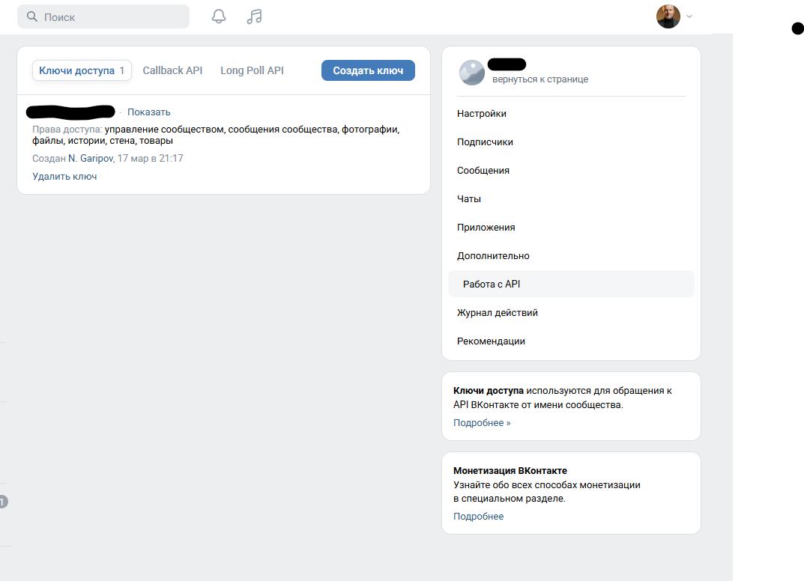
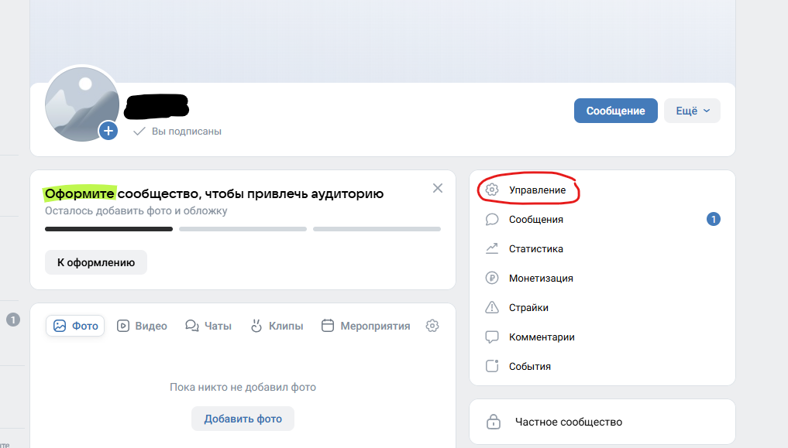
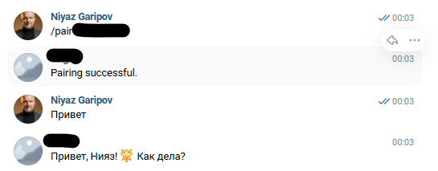

# vk-openclaw-service

## What is it / Что это
VK мессенджер + OpenClaw.

Ещё один канал для OpenClaw в преддверии 1 апреля.

VK - Сообщество - Управление - Работа с API - Ключ - Парринг с OpenClaw - VK мессенджер.

`vk-openclaw-service` is an open-source bridge between VK Messenger and OpenClaw.
The service receives VK messages, runs OpenClaw commands, sends results back to VK, and exposes admin API endpoints for health and audit.

`vk-openclaw-service` - это open-source мост между VK Messenger и OpenClaw.
Сервис принимает сообщения из VK, запускает команды OpenClaw, отправляет ответ обратно в VK и предоставляет admin API для статуса и аудита.

## Features / Возможности
- VK polling worker with controlled retries and backoff.
- Pairing and allowlist flow for safer peer access.
- Config validation endpoint before runtime rollout.
- Audit and dead-letter endpoints for operations visibility.
- Optional PostgreSQL + Redis runtime mode.
- Cross-platform setup wizard (`vk-openclaw setup`) for Linux and Windows.

## Quick Start / Быстрый старт
Detailed platform commands are in `docs/install.md`.

Clone repository / Клонировать репозиторий:
```bash
git clone https://github.com/NiiyazG/VK_OpenClaw_Service.git
cd VK_OpenClaw_Service
ls pyproject.toml
```

Linux one-command setup:
```bash
chmod +x ./install.sh
./install.sh
```

If `systemd --user` is unavailable during setup, installer switches to `fallback-local` automatically, can start local API+worker, and then runs pairing helper in the same setup flow.
On first worker run, old chat history is skipped automatically; bot replies only to new messages after startup.

## Screenshots / Скриншоты

Setup wizard: token input and initial configuration.


Setup wizard: service mode and pairing helper stage.


Fallback-local run: local API/worker launch and runtime checks.

If first setup failed (clean reinstall, Linux):
```bash
systemctl --user stop vk-openclaw-api.service vk-openclaw-worker.service 2>/dev/null || true
cd ~
rm -rf ~/VK_OpenClaw_Service
git clone https://github.com/NiiyazG/VK_OpenClaw_Service.git
cd ~/VK_OpenClaw_Service
chmod +x ./install.sh
./install.sh
```

After reinstall (important):
```bash
source .venv/bin/activate
vk-openclaw status
```
If service mode is `system-service`, `vk-openclaw status` uses `systemctl --user`.
If service mode is `fallback-local`, `vk-openclaw status` uses local PID/API checks.

VK token source (community flow):
1. Create or open your VK community.
2. Go to `Manage -> Advanced -> API access`.
3. Click `Create key`.
4. Use the generated key as `VK_ACCESS_TOKEN`.

Peer ID note:
- DM: `VK_ALLOWED_PEERS` is the user ID.
- Group chat: `VK_ALLOWED_PEERS` is the chat `peer_id`.

Interactive setup now auto-selects:
- `PERSISTENCE_MODE=file`
- `OPENCLAW_COMMAND` from local wrapper or `openclaw`

Use custom values only through non-interactive config:
```bash
vk-openclaw setup --non-interactive --config install.json
```

Windows one-command setup (PowerShell):
```powershell
powershell -ExecutionPolicy Bypass -File .\scripts\setup_windows.ps1
```

Service control / Управление сервисом:
```bash
vk-openclaw start
vk-openclaw status
vk-openclaw stop
```

If `vk-openclaw: command not found`:
```bash
source .venv/bin/activate
vk-openclaw status
```
Or run directly:
```bash
./.venv/bin/vk-openclaw status
```

If `systemctl --user` is unavailable (`Failed to connect to bus`), use fallback mode:
```bash
cd ~/VK_OpenClaw_Service
source .venv/bin/activate
vk-openclaw start
vk-openclaw status
```
If fallback was not paired yet, run pairing helper manually:
```bash
ADMIN=$(grep '^ADMIN_API_TOKEN=' .env.local | cut -d= -f2-)
PEER=$(grep '^VK_ALLOWED_PEERS=' .env.local | cut -d= -f2- | cut -d, -f1)
curl -s -H "Authorization: Bearer $ADMIN" -H "Content-Type: application/json" -d "{\"peer_id\":$PEER}" http://127.0.0.1:8000/api/v1/pairing/code
```
Then send `/pair <code>` in VK chat and validate `/status`, then `/ask hello`.

## Configuration / Конфигурация
Required runtime variables (minimum):
- `ADMIN_API_TOKEN`
- `VK_ACCESS_TOKEN`
- `VK_ALLOWED_PEERS`
- `OPENCLAW_COMMAND`

Use placeholders from `.env.example` and keep real values only in local `.env` / `.env.local`.

## VK Setup / Настройка VK
Step-by-step token and `peer_id` setup:
- `docs/vk_setup.md`

Pairing flow (VK-first):
1. Setup helper requests a code via admin API.
2. If `VK_ALLOWED_PEERS` contains several peers, helper asks `PAIRING_PEER_ID` and uses that peer for code generation.
3. You send `/pair <code>` in the target VK chat.
4. Setup helper waits up to ~15 seconds for the selected peer in `paired peers`.
5. Worker verifies the code from the VK message and replies:
   - `Pairing successful.`
   - `Invalid or expired pairing code.`
6. Setup helper confirms that the peer appears in paired peers.
7. Pairing helper uses `http://127.0.0.1:8000` by default.
   Override only when needed:
   - `VK_OPENCLAW_API_BASE_URL=http://<host>:<port>`

Note:
- `/pair <code>` is handled by worker even when VK marks the message as outgoing (user-token scenario).

If VK does not respond:
- verify `VK_ALLOWED_PEERS` contains the real `peer_id`,
- check `vk-openclaw status`,
- rerun setup and pairing helper.
- check worker log for DNS/token errors:
  - `Temporary failure in name resolution`
  - `VK API error 15: Access denied: token required`

WSL DNS fix (if resolver is unstable):
```bash
sudo bash -c 'printf "[network]\ngenerateResolvConf = false\n" > /etc/wsl.conf && rm -f /etc/resolv.conf && printf "nameserver 1.1.1.1\nnameserver 8.8.8.8\n" > /etc/resolv.conf && chmod 644 /etc/resolv.conf'
```
Then run in Windows PowerShell:
```powershell
wsl --shutdown
```

## Known Issues
- `Failed to connect to bus`: `systemd --user` session bus is unavailable. Use fallback mode above.
- `Temporary failure in name resolution`: DNS is unstable. Apply WSL DNS fix and restart services.

## Security / Безопасность
Never commit:
- `.env` files
- tokens and passwords
- DSN values with credentials
- private keys

Public repository safety checklist:
- `docs/public_repo_open.md`

## Documentation map / Карта документации
- Architecture: `docs/architecture.md`
- Operations runbook: `docs/operations_runbook.md`
- Contributor guide: `CONTRIBUTING.md`
- Installation guide: `docs/install.md`
- Windows one-file guide: `docs/windows_onefile_install.md`

## Author & License / Автор и лицензия
- Author: Гарипов Нияз Варисович
- Email: garipovn@yandex.ru
- License: MIT (`LICENSE`)
